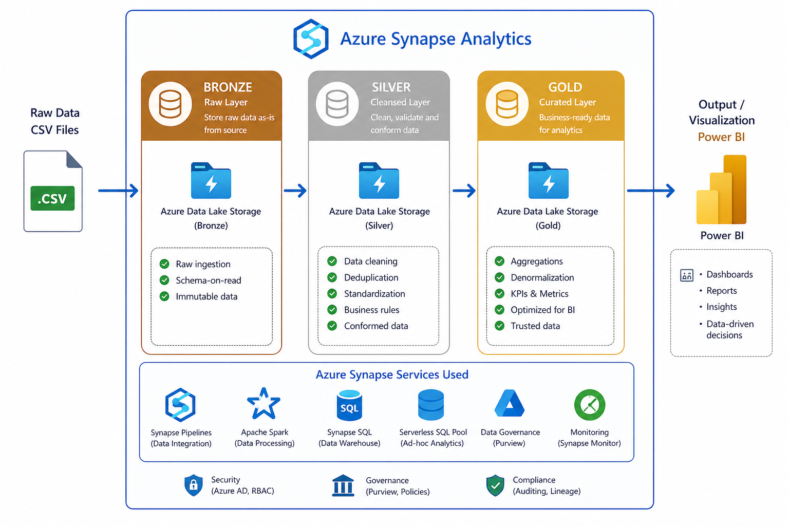
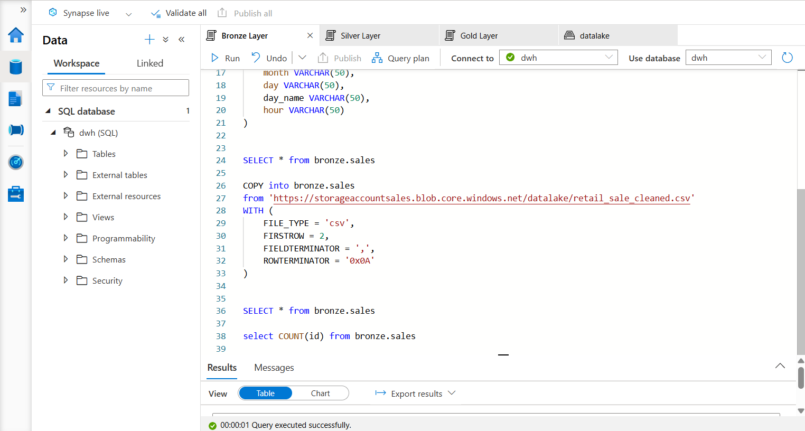
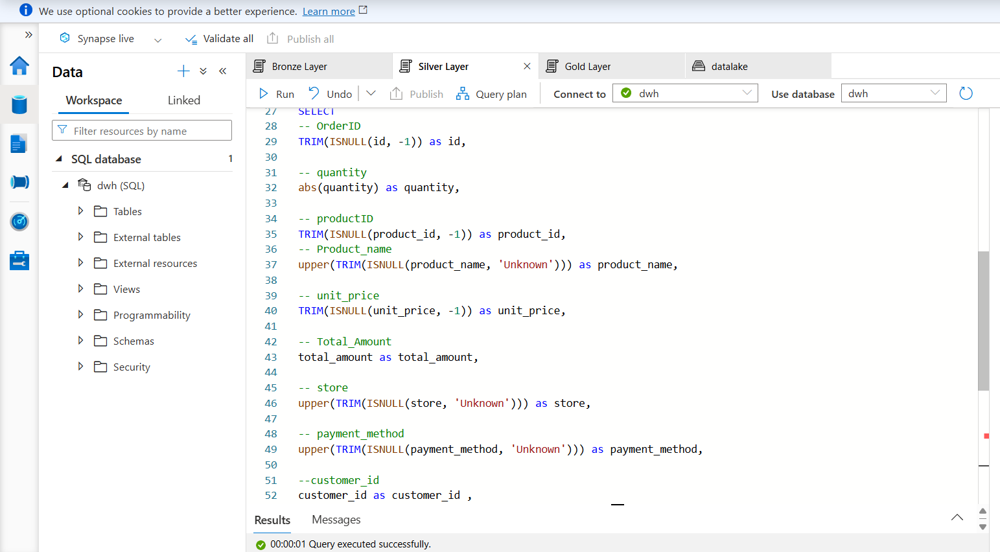
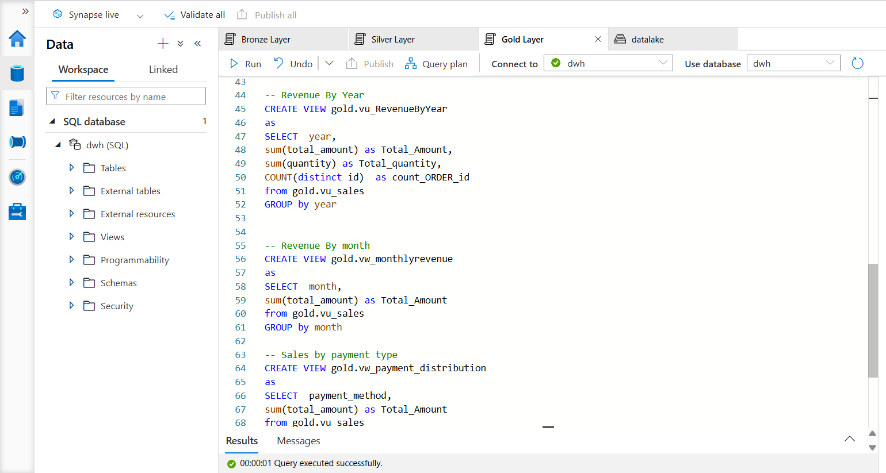
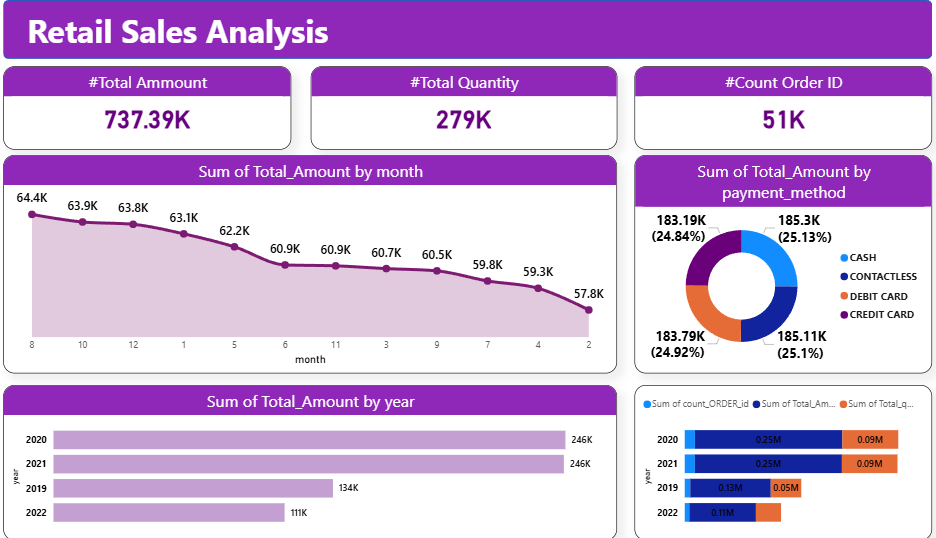

# 📊 Azure Synapse Sales Data Pipeline (Bronze → Silver → Gold)

## 🚀 Overview
This project builds a complete end-to-end data pipeline using Microsoft Azure and Azure Synapse Analytics to transform raw CSV sales data into business insights using the **Medallion Architecture (Bronze, Silver, Gold)**.

The final outputs are visualized using Power BI Desktop.

---

## 🏗️ Architecture

### 📸 Architecture Diagram

---

## 🥉 Bronze Layer (Raw Data)

### 🔹 Role
The Bronze layer is the **raw data ingestion layer**. It stores data exactly as it arrives from the source.

### 🔹 Characteristics
- Raw, unprocessed data
- Minimal or no transformation
- Acts as a backup / source of truth
- Enables reprocessing if needed

### 🔹 Example
- CSV sales file uploaded directly into Azure Synapse Analytics

### 📸 Bronze Layer

---

## 🥈 Silver Layer (Cleaned Data)

### 🔹 Role
The Silver layer is responsible for **data cleaning and transformation** to prepare it for analytics.

### 🔹 Transformations performed:
- Remove duplicates
- Handle missing values
- Fix data types
- Standardize formats (dates, names, etc.)

### 🔹 Why Silver matters
Raw data is inconsistent ❌  
Silver ensures **clean, reliable, and structured data** ✅

### 📸 Silver Layer

---

## 🥇 Gold Layer (Business Insights)

### 🔹 Role
The Gold layer contains **business-ready aggregated data** used for reporting and dashboards.

### 🔹 Output
SQL Views optimized for analytics and reporting

---

## 📊 Gold Layer Views

### 📌 vw_kpis
- Total Sales  
- Total Orders  
- Total Items Sold  

---

### 📌 vw_revenue_by_year
- Yearly sales trends  

---

### 📌 vw_monthly_revenue
- Monthly sales trends  

---

### 📌 vw_payment_distribution
- Sales breakdown by payment type:
  - Cash  
  - Card  
  - Contactless  

---

### 📌 vw_top_customers
- Top 10 customers by total spending  

---

### 📌 vw_store_performance
- Best performing stores based on sales  

---

### 📸 Gold Layer Views

---

## 📈 Power BI Dashboard

The Gold layer is connected to Power BI Desktop for visualization and reporting.

### Dashboard Includes:
- KPI Summary Cards
- Revenue Trends (Yearly & Monthly)
- Payment Method Analysis
- Top Customers Ranking
- Store Performance Insights

### 📸 Dashboard Preview

---

## 🛠️ Technologies Used
- Microsoft Azure
- Azure Synapse Analytics
- SQL
- Power BI Desktop

---

## 🎯 Key Learnings
- Implementing Medallion Architecture (Bronze → Silver → Gold)
- Building scalable data pipelines
- Data cleaning and transformation techniques
- Designing business KPIs
- Creating interactive dashboards

---

---

## 🤝 Collaboration
This project is managed using GitHub.

---

## ⚡ Important Notes
- Keep image names simple (no spaces, commas, or special characters)
- All images must be inside `/images` folder
- Use `.png` or `.jpg` formats only
- Ensure image paths match exactly with filenames in repository

## 📁 Project Structure
